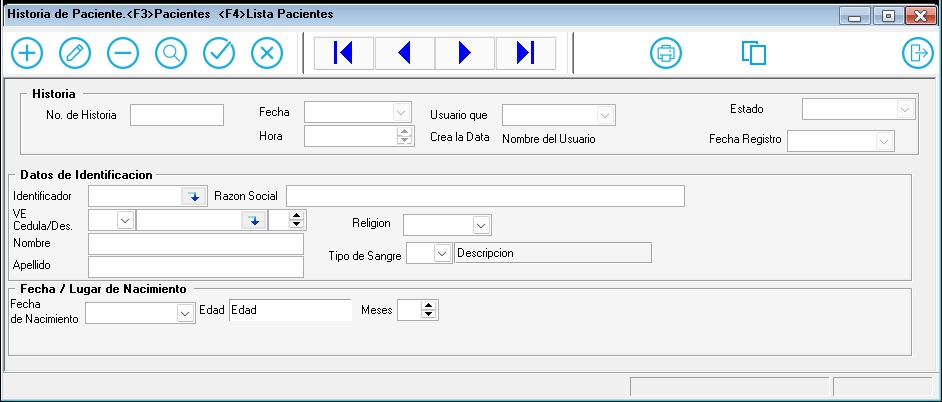

### **Documentación para la Historia de un Paciente**

#### **1. Descripción General**
Pasos para Crear la Información del Formulario
Iniciar el Formulario: Asegúrate de abrir el módulo CREARHISTORIA. Este módulo permite crear una historia única para el paciente.
Los datos suministrados estan en relacion con los datos creados en la plantilla datos pacientes, de aqui el sistema ira actualizando, segun la fecha de naciemiento, la edad del paciente en la historia.

Ejemplo de Uso
---

#### **2. Campos del Formulario**
Llenar Información Básica del Paciente:
Nuemro de Historia: Campo se genera automaticamente o manual de aceurdo a la configuracion Inicial del sistema.
Identificador: Campo que usa para relacionar los datos pacientes creador el los Datos Paciente.
Cédula del Paciente: cédula en el campo proporcionado.
Si existe cargara El identificador automaticamente todos los datos.

Opciones de Comandos y Eventos:

Buscar por Razón Social: Puedes utilizar el comando BuscarRazonSocial para buscar la razón sociallos datos de una historia creada.

##### **2.2. Datos del Paciente Presentados**
- **Historia**:Numero generado internamente como la historia unica del paciente.
- **Nombre**: Nombre del paciente.
- **Apellido**: Apellido(s) del paciente.
- **Cédula**: Número de cédula de identidad del paciente.
- **Fecha de Nacimiento**: Fecha de nacimiento del paciente Formato "DD/MM/YYYY".
- **Identificador**: Identificador relcionado con el Nro de Historia generado automaticamente.
- **Tipo de Sangre**: Tipo de Sangre del Paciente (ARH+,ARH-,ORH+ etc).

---

#### **4. Validaciones y Restricciones**
-**Aceptar o Cancelar:**: Utiliza los comandos Aceptar o Cancelar según corresponda. Si Acepta Graba la Historia

Navegar por el Formulario: Utiliza comandos como Anterior, Siguiente, Primero y Último para navegar por el formulario.

Verificación y Validación:

-**Validación Cabecera: Asegúrate de que todos los campos obligatorios estén completos y sean correctos.

- Cédula: Utiliza el comando VerificarCedulaPac 15bcarcateres validos para verificar la cédula del paciente.
- Identificador: correlativo generado como un Entero grande que define al paciente

---

#### **5. Ejemplo de Interfaz**

---

#### **6. Flujo de Trabajo**

1. El usuario ingresa la información del paciente y los datos de ingreso en los campos correspondientes.
2. El usuario hace clic en "Guardar" para registrar la admisión.
   - Si los campos obligatorios están completos y válidos, la admisión se registra en el sistema.
   - Si hay errores, se muestran mensajes de validación.
3. El usuario puede hacer clic en "Cancelar" para limpiar el formulario y descartar los cambios.

---

#### **7. Pruebas**

- **Caso 1**: Completar todos los campos obligatorios y hacer clic en "Guardar". Resultado esperado: Registro exitoso.
- **Caso 2**: Dejar campos obligatorios vacíos y hacer clic en "Guardar". Resultado esperado: Mensajes de error.
- **Caso 3**: Hacer clic en "Cancelar". Resultado esperado: Limpiar el formulario.

---
