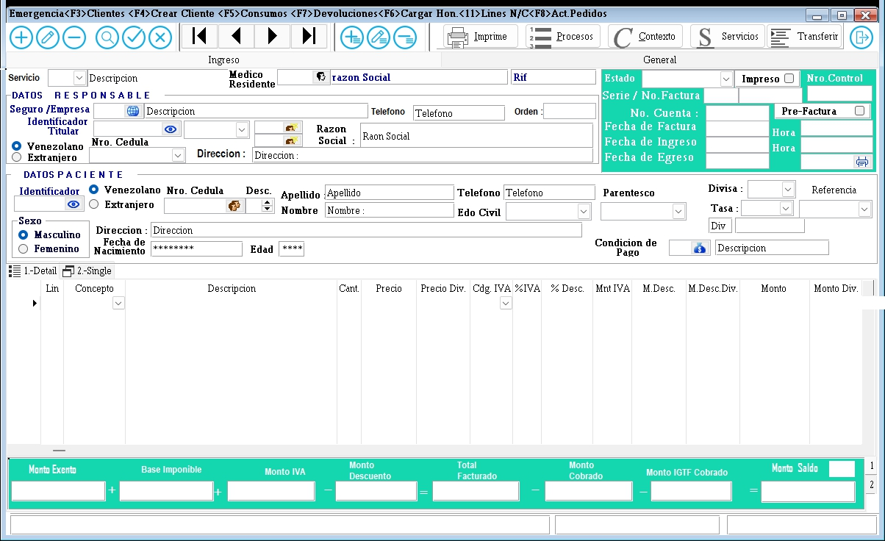

### **Documentación para el Formulario de Gestión de Cuentas del Paciente**

#### **1. Descripción General**
El formulario de gestión de cuentas del paciente por Emergencia es utilizado para gestionar los gastos de servicios y  honorarios médicos asociados a un paciente. 
Aqui Registramos los Item que ingresan a la cta pacientes, esta puede ir a el servicio de hospitalizacion, si es el caso, si es el seguro que cubre la emergencia. 
Los diferentes cargos que se realizan aqui en emergencia son: servicios como RX, imagenes, Anatomia patologica, Banco de Sangre , Laboratorio y Administracion de insumos medicos, 
si los modulos estan integrados pueden cargarse desde el servicio correpondiente con el modulo respectivo, automaticamente aparecen en la cuenta de emergencia, todos los servicion se cargar por orden medica emitida.

#### **2. Campos del Formulario**

##### **2.1. Información del Paciente y Responsable**
- **Identificador Paciente y Responsable**: Identificador paciente y titular , son correaltivos únicos, y al buscar un paciente por nombre, cedula etc ele sitema traera su identificador unico que se relaciona con los datos unico de su cedula.
- **Responsable Seguro / Médico**: Nombre del responsable del seguro o médico. Aqui aparece el medico que realiza la revision o preooperatorio si es el caso del paciente.
- **Datos de Impresión**: Información adicional para la impresión del Edo de cuenta.
- **Datos de cedula paciente/responsable**: Al ingresar la cedula el sistema busca de manera automatica todos los datos del paciente, llenando los campos del ingreso, si existen los traera de forma inmediata. 
	igual pasa con el responsable, es de indicar que estos datos son necesarios y obligatorios para el ingreso.
- **Paciente**: Nombre del paciente.
- **Responsable Seguro / Médico**: Nombre del responsable del seguro o médico.
- **Datos de Impresión**: Información adicional para la impresión de la cuenta creada.

##### **2.2. Detalles de la cuenta**
- **Código Servicio**: Código del servicio médico.
- **No. Cuenta**: Número de cuenta asociado al paciente.
- **Historia**: Número de historia clínica si existe.
- **No. Factura**: Número de la factura, cuando se facture la cuenta ambulatoria.
- **Fecha. de Ingreso**: Fecha de ingreso del paciente y la hora , ambos se guardan, no pueden ser modificados.
- **IdTasa BCV**: Tasa aplicada BCV, La tasa del BCV se ingresa automaticamente si existe en la fecha de carga, si no existe se toma el mayor idtasa. Este Id corresponde a una publicacion de fecha:hora por el BCV.
- **Pre Factura**: Este tilde al ser marcado, se utiliza exclusivo para seguros, esto es una vez cerrada la cuenta con el paciente y el seguro no a dado el monto definitivo de cobertura, se tilda para evitar y hacer saber a los servicios que la cuenta esta precerrada y no pueden aplicar nuevos examenes.
- **Estado**: Estado de la factura (Pendiente, Pagada, etc.).
- **Cédula**: Número de cédula del paciente, este dato pertenece a el id de paciente que se creo o existia en la base de datos clientes/pacientes.
- **Fecha de Egreso**: Fecha de egreso del paciente, fecha en que se dio culminado el acto medico para el paciente ambulatorio.
- **Fecha. de Factura**: Fecha de la factura, este se genra al momento de producir la facturacion Ambulatoria de la Emergencia. 
- **Condiciones. Pago**: Condicion del pago sobre el pago.
- **Descripción**: Descripción adicional de la cuenta, Existe una documentacion de casos que se lleva poor lo general son detalles ingresados por el usuario de la emergencia.

##### **2.3. Montos y Totales en el Fomulario de la Vista**
- **MONTO DESCUENTO**: Suma de Monto de descuento aplicado a cada Item.
- **MONTO EXENTO**: Suma de los Monto exento de impuestos de cada Item.
- **MONTO BASE**: Suma del Monto que contine IVA en cada item.
- **MONTO IVA**: Suma del Monto  IVA en cada item.
- **TOTAL FACTURADO**: Total facturado Sumatoria del Exento + Base + IVA .
- **MONTO IGTF**: Monto de Impuestos 3% a pagos con moneda extranjera(Dollar, EURO etc).
- **MONTO COBRADO**: Monto Total Cobrado.
- **TOTAL SALDO**: Saldo total PENDIENTE.

##### **2.4. Detalles de las lineas de la cuenta creada**
- **Lín**: Línea de la cuenta.
- **Código**: Código del Item o producto.
- **Descripcion**: Descripcion de el item ingresado, automaticamente aparece el definido en la tabla de movimientos del edo. de cuenta.
- **Precio**: Precio del Item.
- **Descuento**: Descuento Item.
- **Descuento**: Descuento Item.
- **No. Recibo**: Número de recibo.
- **Ser**: Serie del recibo.

---

#### **3. Instrucciones para Completar el Formulario**

1. **Información del Paciente y Responsable**:
   - Ingrese el nombre del paciente, el identificador único (Idx), y el nombre del responsable del seguro o médico.
   - Proporcione cualquier información adicional necesaria para la impresión de la factura.

2. **Detalles de la Factura**:
   - Complete el código del servicio, número de cuenta, número de historia clínica, número de factura, fecha de ingreso, tasa aplicada (IPTASA), monto antes de la factura, estado de la factura, cédula del paciente, fecha de egreso, fecha de la factura, comentarios sobre el pago y una descripción adicional.

3. **Montos y Totales**:
   - Ingrese el monto exento, monto de descuento, monto del IVA, total facturado, monto de otros impuestos, monto cobrado y el saldo total pendiente.

4. **Detalles de Recibos**:
   - Proporcione los detalles de cada recibo, incluyendo la línea de detalle, código del servicio o producto, monto individual, monto total, número de recibo y serie del recibo.

---

#### **4. Validaciones y Restricciones**

- **Campos Obligatorios**: Paciente, Idx, Código Servicio, No. Cuenta, No. Factura, Fec. de Ingreso, Estado, Cédula, Fec. de Egreso, Fec. de Factura, MONTO EXENTO, MONTO DESCUENTO, MONTO IVA, TOTAL FACTURADO, MONTO IGTE, MONTO COBRADO, TOTAL SALDO.
- **Formato de Fecha**: Las fechas deben estar en formato DD/MM/AAAA.
- **Longitud Máxima**:
  - Nombre del Paciente: 100 caracteres.
  - Código Servicio: 20 caracteres.
  - No. Cuenta: 15 caracteres.
  - No. Factura: 15 caracteres.
  - Descripción: 200 caracteres.

---

#### **5. Ejemplo de Interfaz**

---

#### **6. Flujo de Trabajo**

1. El usuario ingresa la información del paciente y los detalles de la factura en los campos correspondientes.
2. El usuario ingresa los montos y totales asociados a la factura.
3. El usuario proporciona los detalles de los recibos.
4. El usuario hace clic en "Guardar" para registrar la información.
   - Si los campos obligatorios están completos y válidos, la información se registra en el sistema.
   - Si hay errores, se muestran mensajes de validación.
5. El usuario puede hacer clic en "Cancelar" para limpiar el formulario y descartar los cambios.

---

#### **7. Pruebas**

- **Caso 1**: Completar todos los campos obligatorios y hacer clic en "Guardar". Resultado esperado: Registro exitoso.
- **Caso 2**: Dejar campos obligatorios vacíos y hacer clic en "Guardar". Resultado esperado: Mensajes de error.
- **Caso 3**: Hacer clic en "Cancelar". Resultado esperado: Limpiar el formulario.

---
