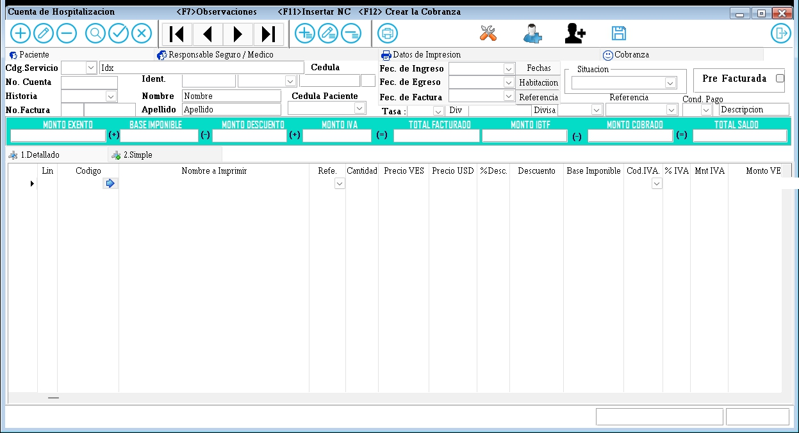

---

### **Documentación para el Formulario de Gestión de Cuentas del Paciente**

#### **1. Descripción General**
El formulario de gestión de cuentas del paciente es utilizado para gestionar los gastos de servicios y honorarios médicos asociados a un paciente. 
La cuenta es creada por la historia, Los cargos pueden venir con items de Emergencia por pasar el paciente a hospitalizado,  
Esta  Agrupa los cargos de los servicios si es integrado con Laboratorio , Imagens, RX y Almacen. Tdoso los item apareceran referenciado por el numero de registro que lo origino, asi un cargo de rx tendra una numeracion que se envia a hospitalizacion y se agraga el codigo de grupo y su numero que lo genero, de tal manera que el numero de recibo indica su origen junto con su servicio. tdoso los datos de la "cabecera" de admision se cargan automaticamente al registar el ingreso, asi que la informacion de paicnete y detalle a continuacion ya viene lista para cargar sus items de lineas.

---

#### **2. Campos del Formulario**

##### **2.1. Información del Paciente y Responsable**
- **Identificador Paciente**: Identifica los datos cargados en el formulario historia/paciente , estos datos seran reflejado como el Nombre y apellido del paciente.
- **Cuenta Nro.**: Identificador único del paciente generado al ingreso por el formulario de admision paciente.
- **Historia**: Historia único del paciente, al crearla en Historia paciente, esto se carga por el proceso de la admision.
- **Responsable Seguro / Médico**: Nombre del responsable del seguro o médico.
- **Datos de Impresión**: Información adicional para la impresión de la cuenta paciente, esta se envia por pantalla.

##### **2.2. Detalles de la cuenta**
- **Código Servicio**: Código del servicio médico.
- **No. Cuenta**: Número de cuenta asociado al paciente.
- **Historia**: Número de historia clínica.
- **No. Factura**: Número de la factura.
- **Fec. de Ingreso**: Fecha de ingreso del paciente.
- **IDTasa**: Tasa aplicada, el id corresponde a un correlativo cada ves que se carga automaticamente las tasa publicada por el BCV, este Identificador es un apuntador al motno de la tasa por fecha de la carga del BCV.
- **Pre Factura**: Indica el status para dar el monto al seguro, este estado es antes de facturarla.
- **Estado**: Estado de la cuenta en el saldo (Pendiente, Pagada, etc.).
- **Cédula**: Número de cédula del paciente.
- **Fecha de Ingreso**: Fecha de Ingreso del paciente.
- **Fecha de Egreso**: Fecha de egreso del paciente.
- **Fecha de Factura**: Fecha de emision de la factura creada a partir del edo de cuenta.
- **Condicion de Pago**: Condicion de pago de La factura al ser generada.
- **Descripción**: Descripción adicional y comentario de la cuenta paciente.

##### **2.3. Montos y Totales**
- **MONTO EXENTO(EXE)**: Monto exento de impuestos(IVA).
- **MONTO DESCUENTO**: Monto de descuento aplicado.
- **MONTO BASE(ORD)**: Monto base para el impuesto(IVA).
- **MONTO IVA**: Monto del IVA TOTAL CALCULADO.
- **TOTAL CUENTA**: Total facturado que corresponde al monto Exento + Monto Base + Monto IVA.
- **MONTO IGTF**: Monto de otros impuestos(IGTF 3%). Este monto sera reflejado al moneto de facturar, el cuel ya a sido cobrado en Caja y enviado a la cta al momento de Facturar.
- **MONTO COBRADO**: Monto cobrado. Sumatoria de abonos aplicados y totalizando el pago, incluye el IGTF.
- **TOTAL SALDO**: Saldo total de la cuenta.

##### **2.4. Registro de Lineas, Detalles de Recibos**
- **Lín**: Línea de detalle. Este campo es un numero incremental por cada registro agregado en los registros de lineas  de la cuenta.
- **Código o Item**: Código del Item. Este codigo corresponde a un movimeinto agrupado o detail que se carga a cobrar, esto representa cualquier servicio a cobrar a la cuenta, por tanto aparece el servicio, el codigo y recibo si corresponde.
- Cuando el Item es un tercero que en el caso de las clinicas es un Honorrios Medico por lo genral, esto es una cxpagar que se factura y sera diferenciada en los libros de ventas por ser una colummna de terceros, no es un igreso clinico.
- **Cantidad**: Cantidad del item o movimiento de servicio cargado.
- **Precio**: precio del item o movimiento de servicio cargado.
- **Total Monto**: Monto total del precio * cantidad.
- **No. Recibo**: Número de recibo.
- **Servicio**: Serivicio del recibo.
- **Grupo**: Grupo del servicio que se utiliza para la impresion , los grupos de H.M o terceros no se modifican , siempren van en una fila totalizadas como Honorarios medicos(Gastos de terceros).Los terceros internamnete se generan con un correlaitvo consecutivo para    cada uno, este se actualiza cuando se factura la cuenta, y la tabla de servcios medicos actualiza el correlativo.

---

#### **3. Instrucciones para Completar el Formulario**

1. **Información del Paciente y Responsable**:
   - Ingrese el nombre del paciente, el identificador único (Idx), y el nombre del responsable del seguro o médico.
   - Proporcione cualquier información adicional necesaria para la impresión de la factura.

2. **Detalles de la Cuenta al Facturar**:
   - Complete el código del servicio, número de cuenta, número de historia clínica, número de factura, fecha de ingreso, tasa aplicada (IdTasa), monto facturado(del total de la cuenta), estado de la factura, cédula del paciente, fecha de egreso, fecha y hora de emision factura, condicion de pago y una descripción adicional.

3. **Montos y Totales**:
   - Los montos son calculados automaticamente: monto exento, monto base, monto del IVA, total facturado, monto de otros impuestos, monto cobrado y el saldo total.

4. **Lineas de Registros o Detalles de Recibos**:
   - Proporcione los detalles de cada recibo, incluyendo la línea de detalle,  código del servicio origen, item o codigo, precio,cantidad, monto total, número de recibo caso de servicios que se involucran, se lleva una fecha de cada registro, usuario y maquina que lo creo.Estos datos ultimos son ocultos y no se pueden modificar.

---

#### **4. Validaciones y Restricciones**

- **Campos Obligatorios**: Identificador Paciente, Identificador Responsable, Código Item, No. Cuenta,  Fecha de Ingreso, Estado, Cédula, Fecha de Egreso,  MONTO EXENTO, MONTO DESCUENTO, MONTO IVA, TOTAL FACTURADO, MONTO IGTE, MONTO COBRADO, TOTAL SALDO.
- **Formato de Fecha**: Las fechas deben estar en formato DD/MM/AAAA.
- **Longitud Máxima**:
  - Nombre del Paciente: 100 caracteres.
  - Código Servicio: 20 caracteres.
  - No. Cuenta: 15 caracteres.
  - No. Factura: 15 caracteres.
  - Serie : 5 caracteres
  - Descripción: 1080 caracteres.

---

#### **5. Ejemplo de Interfaz**

---

#### **6. Flujo de Trabajo**

1. El usuario ingresa la información del paciente y los detalles de la cuenta en la admision, previamente cargada la historia, todos esto al llenar la admision se carga automaticamente los campos correspondientes.
2. El usuario  generara la Factura paciente por facturacion.
3. El usuario proporciona los detalles de las lineas correspondientes a convenios con seguros, descuentos aplicados por autorizaciones administrativas.
4. El usuario hace clic en "Guardar" para registrar la información decada linea, una ves que se aplica el proceso de facturacion solo se podra Aplicar Notas de creditos o debitos para realizar modificacion ya en la factura generada.
   - Si los campos obligatorios están completos y válidos, la información se registra en el sistema.
   - Si hay errores, se muestran mensajes de validación.
5. El usuario puede hacer clic en "Cancelar" para limpiar la linea de el formulario y descartar los cambios.

---

#### **7. Pruebas**

- **Caso 1**: Completar todos los campos obligatorios y hacer clic en "Guardar<F1>". Resultado esperado: Registro exitoso.
- **Caso 2**: Dejar campos obligatorios vacíos y hacer clic en "Guardar<F1>". Resultado esperado: Mensajes de error.
- **Caso 3**: Hacer clic en "Cancelar". Resultado esperado: Limpiar el formulario.

---
