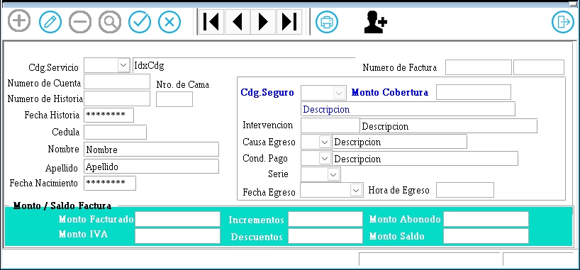
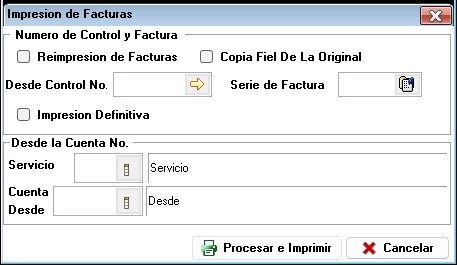

---

### **Documentación para el Formulario de Facturación a Pacientes**

#### **1. Descripción General**
El formulario de facturación a pacientes es utilizado para generar facturas de manera transaccional. 
Una vez que la factura es generada, no puede ser modificada. Si es necesario anular una factura, se debe emitir una nota de crédito. Este formulario captura información detallada sobre el paciente, los servicios proporcionados, los montos facturados y los saldos pendientes.

---

#### **2. Campos del Formulario**

##### **2.1. Información del Paciente**
- **Código Servicio**: Código del servicio médico proporcionado.
- **Descripcion del Servicio**: Descripcion del Servicio a facturar.
- **Número de Cuenta**: Número de cuenta asociado al paciente en Hospitalizacion.
- **Número de Cama**: Número de cama asignada al paciente.
- **Número de Historia**: Número de historia clínica del paciente.
- **Fecha Historia**: Fecha de la historia clínica.
- **Cédula/RIF**: Número de Cedula/RIF del paciente.
- **Nombres/Apellidos**: Nombre completo del paciente .
- **Fecha de Nacimiento**: Fecha de nacimiento del paciente.
- **Sexo**: Género del paciente.

##### **2.2. Información del Seguro**
- **Codigo**: Codigo del Seguro, Si el seguro = "00000" y referencia 1 es un particular, por tanto se factura y el responsable se asigna en la admision del paciente.
- **Diagnóstico**: Diagnóstico principal del paciente.
- **Causa Egreso**: Razón del egreso del paciente.** Es Modificable 
- **Cond. Pago**: Condiciones de pago.** Es Modificable.
- **Serie**: Serie de la factura.**No se Modifica es Automatico definido por la configuracion del sistema.
- **Fecha Egreso**: Fecha de egreso del paciente.**Es Modificable por defecto la fecha del dia.
- **Hora Egreso**: Hora de egreso del paciente por defecto la del sistema.
- **Numero de Factura** Este campo solo se llena al momento de Aceptar o Aplicar F1 que genera el proceso transaccional de la facturacion.

##### **2.3. Montos y Saldos**
- **Monto Cobertura**: Monto cubierto por el seguro. Si la cobertura es automatica el sistema carga una cobertura inicial dada por el monto total de la factura al seguro.
- **Descripción**: Descripción de los servicios o productos facturados.
- **Monto/Saldo Factura**: Monto total de la factura y saldo pendiente.
- **Monto Factura**: Monto total facturado.
- **Incrementos**: Incrementos aplicados al monto facturado.
- **Monto Abono**: Monto abonado por el paciente.
- **Decrementos**: Decrementos aplicados al monto facturado.
- **Monto Saldo**: Saldo pendiente de pago.

---

#### **3. Instrucciones para Completar el Formulario**

1. **Información del Paciente**:
   - Al facturar desde un servicio una cuenta todos los datos son enviados automaticamente y no pueden modificarseo, identificador único (IdxCóg), número de cuenta, número de cama, número de historia, fecha de la historia clínica, cédula o RIF, nombre completo, fecha de nacimiento y sexo del paciente.
   - 
2. **Información del Seguro**:
   - Proporcione el diagnóstico principal, la causa del egreso, las condiciones de pago, la serie de la factura, la fecha y hora de egreso.

3. **Montos y Saldos**:
   - Ingrese el monto de cobertura del seguro, la descripción de los servicios o productos facturados, el monto total de la factura, los incrementos, el monto abonado, los decrementos y el saldo pendiente.

---

#### **4. Validaciones y Restricciones**

- **Campos Obligatorios**: Código Servicio, IdxCóg, Número de Cuenta, Número de Historia, Fecha Historia, Cédula/RIF, Nombres/Apellidos, Fecha de Nacimiento, Sexo, Diagnóstico, Causa Egreso, Cond. Pago, Serie, Fecha Egreso, Hora Egreso, Monto Cobertura, Descripción, Monto Factura, Monto Saldo.
- **Formato de Fecha**: Las fechas deben estar en formato DD/MM/AAAA.
- **Longitud Máxima**:
  - Nombres/Apellidos: 100 caracteres.
  - Código Servicio: 20 caracteres.
  - Número de Cuenta: 15 caracteres.
  - Descripción: 200 caracteres.

---

#### **5. Ejemplo de Interfaz**

---

#### **6. Flujo de Trabajo**

1. El usuario ingresa la información del paciente y los detalles de la factura en los campos correspondientes.
2. El usuario agrega la causa de egreso y condicion de pago de la factura, si es el caso por defecto seguro son Creditos "02" y particular o cash son "01" Efectivo.
3. El usuario hace clic en "Guardar" <F1> para generar la factura.
   - Si los campos obligatorios están completos y válidos, la factura se genera y no puede ser modificada.
   Se muestra un Msg de Impresion para enviarla a la printer o cuqluier medio definido en el sistema para tal fin.
   
   - Si hay errores, se muestran mensajes de validación.
4. El usuario puede hacer clic en "Cancelar" para limpiar el formulario y descartar los cambios.

---

#### **8. Pruebas**

- **Caso 1**: Completar todos los campos obligatorios y hacer clic en "Guardar". Resultado esperado: Factura generada exitosamente.
- **Caso 2**: Dejar campos obligatorios vacíos y hacer clic en "Guardar"<F1>. Resultado esperado: Mensajes de error.
- **Caso 3**: Hacer clic en "Cancelar". Resultado esperado: Limpiar el formulario.

---
