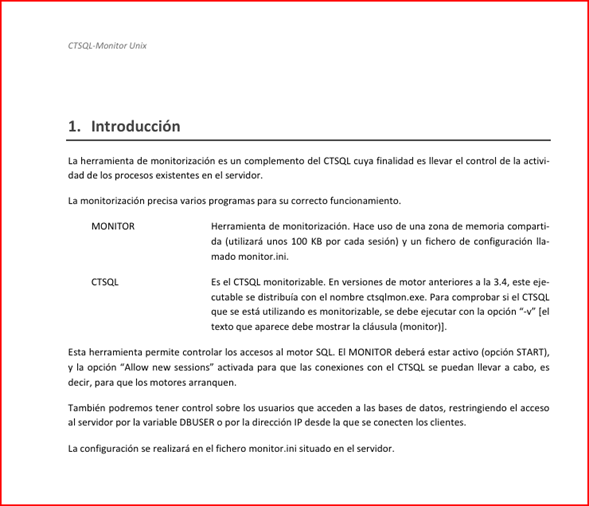
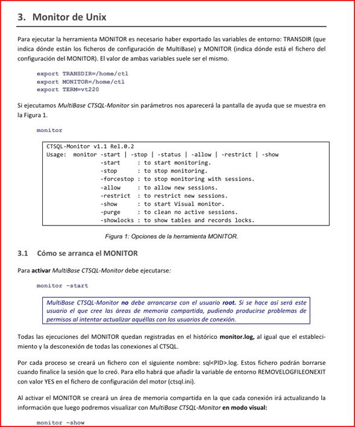

### **Introducción**

1. Instalación y Configuración Inicial

1.1 Requisitos del Sistema

- *Sistema Operativo:* Windows 10/11, cliente
-. Tecnologia Multiway(Server Base de Datos(ctsql))
El gestor de base de datos CTSQL puede funcionar tanto en modo local como en cliente-servidor, disponiendo en ambos casos de capacidad “multiservidor”. 
Es decir, una misma instancia del lenguaje de cuarta generación CTL puede mantener abiertas de manera simultánea varias bases de datos a través de una única instancia del CTSQL. 
MultiBase dispone de dos mecanismos diferentes de conectividad. El primero de ellos, a través del estándar ODBC de Microsoft, asegura un intercambio de datos con otras aplicaciones en los entornos gráficos más ac tuales. 
El segundo, MultiWay, permite la conexión en cliente-servidor tanto con bases de datos propias de MultiBase como con las bases de datos con interfaz SQL más extendidas del mercado. 
Este tipo de conexión a través de MultiWay presenta la ventaja de no necesitar modificación alguna en los programas fuentes. 
MultiWay es una tecnología que dota a MultiBase y a Cosmos de unas extraordinarias prestaciones en instala ciones con arquitectura cliente-servidor. 
MultiWay es una capa de software que permite a los lenguajes de MultiBase y Cosmos, y por tanto a cualquier aplicación desarrollada con ambas herramientas, el acceso transparente a diferentes gestores de bases de da tos.
Dicho acceso puede hacerse en modo local (lenguaje de desarrollo y servidor de base de datos en una misma máquina) o en modo cliente-servidor (lenguaje de desarrollo y servidor de base de datos en máquinas distintas). 
Para ello, MultiWay se apoya en diferentes estándares del mercado, el SQL como lenguaje de interfaz con ba ses de datos relacionales, el TCP/IP 
como protocolo de comunicaciones y la librería WINSOCK.DLL como están dar para TCP/IP en el caso del Windows (máquina cliente). 
La arquitectura del sistema es sencilla y muy ligera, no exigiendo, entre otras cosas, el soporte de red proporcionado por el correspondiente fabricante del gestor de base de datos. 
Esta capa de software, que se sitúa al lado del servidor de la base de datos, hace a MultiBase independiente de otras capas de software de red de otros fabricantes de bases de datos, 
permitiendo la conexión remota y el enlace lógico entre el lenguaje de cuarta generación CTL y el SQL de distintos fabricantes. 
MultiWay se encarga de proporcionar una visión homogénea de cualquier SQL que se conecte a los lenguajes de desarrollo de MultiBase y Cosmos, ofreciendo un único “set” de tipos de datos entre los diferentes “sets” de los distintos 
gestores de base de datos y una única gramática, al tiempo que se encarga de que cualquier con versión de tipo sea realizada de forma ortogonal. 
Por último, MultiWay se encarga de la traducción de sentencias de SQL entre los distintos gestores de bases de datos soportados. Dichos gestores son los siguientes: • CTSQL de MultiBase y Cosmos. • Oracle. • Informix-OnLine e Informix-SE.

---

### **Índice**

Con esta implementación todas las conexiones a la Base de Datos se monitorean, deben pasar por ahí y todos los  accesos visualizarse, por tanto se pueden bloquear, eliminar y verificar su estado.

## **Monitoreo y Auditoria** 

2 Para las auditorias utilizamos el Mecanismo de Tablog.
Permite mantener un registro, «o log», de operaciones de inserción, borrado y modificación sobre tablas. Los datos relativos a esas operaciones se almacenan en tablas de 
la base de datos que deben ser creadas por los usuarios exclusivamente para ese fin.
Así para cada tabla de la base de datos cuyas operaciones se deseen registrar deberá existir otra tabla en la base de datos en la cual se almacenará información sobre dichas operaciones. 
Nos referiremos a esta segunda tabla como tabla de movimientos.
tabla de movimientos
Cada tabla de movimientos almacena información sobre una tabla concreta de la base de datos de la cual se desea llevar un registro de operaciones realizas. 
Hay información que se guarda siempre e información opcional que el usuario puede configurar para que seguarde o no.
Una tabla de movimientos debe ser creada con la misma estructura de campos de la tabla a analizar, más una serie de campos por delante, que han de ser del siguiente tipo:
•	char(1): Indicará el código de la operación que se ha realizado sobre la tabla a analizar. Sus posibles valores son:
•	I. Se ha efectuado un «insert».
•	U. Se ha efectuado un «update».
•	D. Se ha efectuado un «delete».
•	serrial. Almacenará un número consecutivo.
•	date. Almacenará la fecha en que se llevó a cabo la operación sobre la tabla a analizar.
•	time. Almacenará la hora en que se llevó a cabo la operación sobre la tabla a analizar.
•	char(16). Almacenará el usuario que realizó la operación sobre la tabla a analizar.
•	char(16). Almacenará la dirección IP desde la que realizó la operación sobre la tabla a analizar.
Los dos primeros campos son obligatorios, y además deben aparecer en ese orden por delante de los campos de la tabla a analizar. Los cuatro restantes son opcionales.
El hecho de almacenar un «serial» en la tabla de movimientos responde a la necesidad de poder tener una clave en dicha tabla que identifique unívocamente cada una de las filas, 
para que se pueda distinguir el orden en que se hicieron las operaciones sobre la tabla analizada. No obstante, esto hace que si en una tabla analizada tenemos un campo «serial», 
deberemos sustituirlo en la tabla de movimientos por un «integer», ya que  CTSQL no puede tener una tabla con dos campos de este tipo.
Configuración

Los pasos a seguir para activar este mecanismos son los siguientes:
2.1	**Fichero de Configuracion**
Se utiliza un fichero de configuración que indicará para qué tabla o tablas de la base de datos se ha de utilizar este mecanismo (es decir, qué taba se desea analizar). Este fichero, llamado «systablog», es un fichero de texto que deberá estar situado en el directorio de la base de datos y habrá de tener permiso de lectura para todos los usuarios.
La estructura del fichero consta de tres campos separados por espacios en blanco:
•	El primer campo indica la tabla a analizar.
•	El segundo indica el nombre de la tabla donde quedará reflejada las operaciones afectadas sobre la primera.
•	El tercero es una especificación de cuál de los campos opcionales de la tabla de movimientos se incluyes en ésta. Cada uno de esos campos se especifica mediante una letra.
•	D=fecha
•	T=hora
•	U=usuario
•	I=dirección IP
Los dos primeros son obligatorios, pero no el tercero y el cuarto.
Ejemplo
Supongamos que tenemos la base de datos de la demo de «almafac» en «c:\cosmos\projects\ALMAFAC» y queremos activar este mecanismo para «clientes», «provincias» y «unidades». El fichero «systablog» deberá estar ubicado en 
c:\cosmos\projects\ALMAFAC\almafac.dbs» y sus entradas podrían ser:
clientes climov DTUI
provincias provmov UD
unidades unimov
Con esta configuración, la tabla de movimientos para clientes guardaría información acerca de la fecha, la hora, el usuario y la dirección IP; la tabla de movimientos para provincias guardaría información sobre el usuario y la fecha, 
y la tabla de movimientos para unidades guardaría información sobre la fecha (la información por defecto). Además, todas ellas guardarían el código de la operación, un «serial» y el registro sobre el que se ha actualizado.
2.2	**Base de datos de Movimientos**
Las tablas de movimientos asociadas son tablas de la base de datos, y han de estar creadas antes de activar este mecanismo. La estructura de campos de una tabla de movimientos será la misma que la de la tabla a la que se refiere, 
pero por delante llevará los campos obligatorios que se ha descrito anteriormente, y tras éstos, los opcionales, siempre en el mismo orden en que aparecen en la especificación de «systalog». 
Es decir, para el «systablog» del ejemplo anterior, si la estructura de la tablas «clientes», «provincias» y «unidades» es:

create table clientes
(cli smallint, 
nom char(20), 
prov char(40))
 
 
create table provincias
(codigo smallint, 
nombre char(20))

 
create table unidades
(unidad serial, 
descripcion char(10))
Entonces la estructura de las tablas de movimientos habría de ser la siguiente:
create table climov
(op char(1),
ser serial,
fecha date,
hora time,
usuario char(16),
dirip char(16),
cli smallint, nom char(20), prov char(40))

 
create table provmov
(op char(1),
ser serial,
usuario char(16),
fecha date,
codigo smallint, nombre char(20))
 
create table unimov
op char(1),
ser serial,
fecha date,
unidad integer, descripcion char(10))

El nombre de los campos de la tabla de movimientos puede ser cualquiera, con tal de que se respeten los tipos de datos.
Tal y como se ha indicado, si la tabla que se va a analizar posee algún campo de tipo «serial», en la de movimientos éste tiene que sustituirse por uno de tipo «integer». 
Esto lo vemos ilustrado en el ejemplo, para el caso de la tabla «unimov».

---

