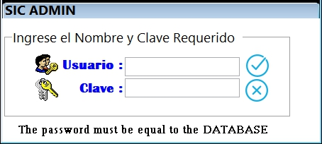

<!DOCTYPE html>
<html lang="es">
<head>
    <meta charset="UTF-8">
    <title>Documentación del Formulario de Inicio de Sesión</title>
</head>
<body>
    <h2>Documentación del Formulario de Inicio de Sesión</h2>
    <h3>1. Descripción General</h3>
    
El formulario de inicio de sesión es la puerta de entrada al sistema administrativo. Permite a los usuarios autenticarse ingresando sus credenciales (usuario y contraseña). Además, incluye dos botones, "Aceptar" para validar las credenciales y "Cancelar" para limpiar los campos y cerrar el formulario.

    <h3>2. Campos del Formulario</h3>
    <h4>2.1. Campo de Usuario</h4>
    <ul>
        <li><strong>Etiqueta</strong>: "Usuario"</li>
        <li><strong>Tipo de Campo</strong>: Texto</li>
        <li><strong>Descripción</strong>: El usuario debe ingresar su nombre de usuario o código registrado en el sistema.</li>
        <li><strong>Requisitos</strong>:
            <ul>
                <li>El campo es obligatorio.</li>
                <li>No distingue entre mayúsculas y minúsculas.</li>
                <li>Longitud máxima: 50 caracteres.</li>
            </ul>
        </li>
        <li><strong>Validación</strong>:
            <ul>
                <li>No puede estar vacío.</li>
                <li>Debe coincidir con un usuario registrado en la base de datos.</li>
            </ul>
        </li>
    </ul>
    <h4>2.2. Campo de Contraseña</h4>
    <ul>
        <li><strong>Etiqueta</strong>: "Contraseña"</li>
        <li><strong>Tipo de Campo</strong>: Contraseña (texto oculto)</li>
        <li><strong>Descripción</strong>: El usuario debe ingresar su contraseña.</li>
        <li><strong>Requisitos</strong>:
            <ul>
                <li>El campo es obligatorio.</li>
                <li>Distingue entre mayúsculas y minúsculas.</li>
                <li>Longitud máxima: 20 caracteres.</li>
            </ul>
        </li>
        <li><strong>Validación</strong>:
            <ul>
                <li>No puede estar vacío.</li>
                <li>Debe coincidir con la contraseña asociada al usuario.</li>
            </ul>
        </li>
    </ul>
    
Las contraseñas permanecen encriptadas en la base de datos, por tanto no se puede visualizar cuál es. Si un usuario olvida su contraseña, el administrador solo puede reiniciarla para que entre en una sesión y pida el sistema el cambio. Así agrega nuevamente su contraseña.

    <h3>3. Botones del Formulario</h3>
    <h4>3.1. Botón "Aceptar"</h4>
    <ul>
        <li><strong>Etiqueta</strong>: "Aceptar"</li>
        <li><strong>Acción</strong>:
            <ul>
                <li>Valida que los campos de usuario y contraseña no estén vacíos.</li>
                <li>Verifica que las credenciales coincidan con los registros en la base de datos.</li>
                <li>Si las credenciales son válidas, redirige al usuario al dashboard o página principal del sistema.</li>
                <li>Si las credenciales son incorrectas, muestra un mensaje de error: "Usuario o contraseña incorrectos".</li>
            </ul>
        </li>
        <li><strong>Comportamiento</strong>:
            <ul>
                <li>Deshabilita el botón después de hacer clic para evitar múltiples intentos.</li>
                <li>Muestra un indicador de carga mientras se procesa la solicitud.</li>
            </ul>
        </li>
    </ul>
    <h4>3.2. Botón "Cancelar"</h4>
    <ul>
        <li><strong>Etiqueta</strong>: "Cancelar"</li>
        <li><strong>Acción</strong>:
            <ul>
                <li>Limpia los campos de usuario y contraseña.</li>
                <li>Cierra el formulario (si está en una ventana emergente) o redirige a la página de inicio.</li>
            </ul>
        </li>
        <li><strong>Comportamiento</strong>:
            <ul>
                <li>No realiza validaciones ni envía datos al servidor.</li>
            </ul>
        </li>
    </ul>
    <h3>4. Mensajes de Error y Validación</h3>
    <ul>
        <li><strong>Usuario vacío</strong>: "Por favor, ingrese su nombre de usuario."</li>
        <li><strong>Contraseña vacía</strong>: "Por favor, ingrese su contraseña."</li>
        <li><strong>Credenciales incorrectas</strong>: "Usuario o contraseña incorrectos. Intente nuevamente."</li>
        <li><strong>Usuario no encontrado</strong>: "El usuario no está registrado en el sistema."</li>
    </ul>
    <h3>5. Ejemplo de Interfaz</h3>
    
A continuación, se muestra un ejemplo visual del formulario:

    
    <h3>6. Flujo de Trabajo</h3>
    <ol>
        <li>El usuario ingresa su nombre de usuario en el campo correspondiente.</li>
        <li>El usuario ingresa su contraseña en el campo correspondiente.</li>
        <li>El usuario hace clic en "Aceptar" para iniciar sesión.
            <ul>
                <li>Si las credenciales son válidas, se redirige al usuario al sistema.</li>
                <li>Si las credenciales son incorrectas, se muestra un mensaje de error.</li>
            </ul>
        </li>
        <li>Si el usuario hace clic en "Cancelar", se limpian los campos y se cierra el formulario.</li>
    </ol>
    <h3>7. Requisitos Técnicos</h3>
    <ul>
        <li><strong>Tecnología</strong>: HTML, CSS, JavaScript (para validaciones del lado del cliente).</li>
        <li><strong>Backend</strong>: Validación de credenciales en la base de datos (por ejemplo, usando SQL o un servicio de autenticación).</li>
        <li><strong>Seguridad</strong>:
            <ul>
                <li>La contraseña debe transmitirse de manera segura (usar HTTPS).</li>
                <li>Almacenar contraseñas encriptadas en la base de datos (usar algoritmos como bcrypt).</li>
            </ul>
        </li>
    </ul>
    <h3>8. Pruebas</h3>
    <ul>
        <li><strong>Caso 1</strong>: Ingresar credenciales válidas y hacer clic en "Aceptar". Resultado esperado: Inicio de sesión exitoso.</li>
        <li><strong>Caso 2</strong>: Ingresar credenciales incorrectas y hacer clic en "Aceptar". Resultado esperado: Mensaje de error.</li>
        <li><strong>Caso 3</strong>: Hacer clic en "Cancelar". Resultado esperado: Limpiar campos y cerrar el formulario.</li>
    </ul>
</body>
</html>
