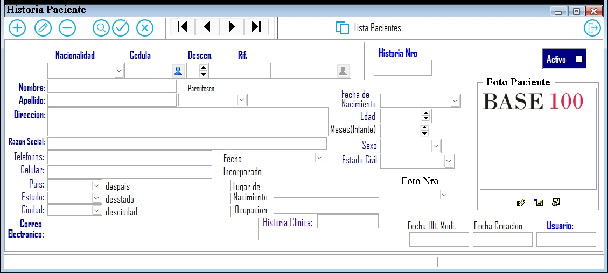

---

### **Documentación para el Registro de un Paciente**

#### **1. Descripción General**
El formulario de registro de pacientes es utilizado para capturar y almacenar información detallada sobre cada paciente. Esta información es esencial para el seguimiento médico, la gestión de historias clínicas y la administración de servicios de salud.

---

#### **2. Campos del Formulario**

##### **2.1. Información Básica del Paciente**
- **Nombre**: Nombre completo del paciente.
- **Apellido**: Apellido(s) del paciente.
- **Fecha de Nacimiento**: Fecha de nacimiento del paciente.
- **Edad**: Edad del paciente.
- **Meses (Infante)**: Edad en meses para pacientes infantiles.
- **Sexo**: Género del paciente (Masculino, Femenino, Otro).
- **Foto Paciente**: Campo para cargar una foto del paciente.

##### **2.2. Información de Identificación**
- **Nacionalidad**: Nacionalidad del paciente.
- **Cédula**: Número de cédula de identidad del paciente.
- **RIF**: Registro de Información Fiscal (si aplica).
- **Historia Manual**: Número de historia clínica manual (si existe).
- **Historia Nro**: Número de historia clínica electrónica.
- **Activo**: Indicador de si el paciente está activo en el sistema.

##### **2.3. Información de Contacto y Ubicación**
- **Dirección**: Dirección de residencia del paciente.
- **Estado**: Estado o provincia de residencia.
- **Ciudad**: Ciudad de residencia.
- **Lugar de Nacimiento**: Lugar donde nació el paciente.

##### **2.4. Información Adicional**
- **Parentesco**: Relación familiar o de parentesco (si aplica). En un Mayor de edad no aplica. Solo en menores que tienen descendientes >0.
- **Ocupación**: Profesión u ocupación del paciente.
- **Fecha Creación**: Fecha en que se registró al paciente en el sistema.
- **Fecha Modificación**: Fecha de la última modificación del registro.

---

#### **3. Instrucciones para Completar el Formulario**

1. **Nombre y Apellido**: Ingrese el nombre completo del paciente.
2. **Fecha de Nacimiento**: Seleccione la fecha de nacimiento del calendario.
3. **Edad**: La edad se calculará automáticamente basándose en la fecha de nacimiento.
4. **Meses (Infante)**: Si el paciente es un infante, ingrese la edad en meses.
5. **Sexo**: Seleccione el género del paciente.
6. **Foto Paciente**: Cargue una foto reciente del paciente.
7. **Nacionalidad**: Seleccione la nacionalidad del paciente."V"enezolano,"E"xtranejero,"P"asaporte
8. **Cédula**: Ingrese el número de cédula del paciente.tiene 12 caracteres. 
9. **RIF**: Si aplica, El Rif por defecto se compone con la Nacionalidad("V","E","P") y la cedula paciente, ingrese el RIF del paciente.
	Si es una cedula de Extranjero muy grande se carga perfectamente en el RIF, el sistema siempre al emitir una factura imprime es el campo RIF.
	Cuando el paciente es un menor de edad que no posee cedula el sistema toma como base la cedula del padre o madre y utiliza un correlativo de descendiente >0 para identificarlo.
	En este caso debe existir en la admision un responsable el cual sera su madre, padre  o alguien definido en su ingreso.
	Por supuesto este Responsable para el caso sera el RIF de Factura que se impima.
11. **Historia Manual**: Si existe, ingrese el número de historia clínica manual.
12. **Historia Nro**: Ingrese el número de historia clínica electrónica.
13. **Activo**: Marque esta casilla si el paciente está activo en el sistema.
14. **Dirección**: Ingrese la dirección completa del paciente o responsable, el caso de responsable y es su direccion fiscal..
15. **Estado y Ciudad**: Seleccione el estado y la ciudad de residencia.
16. **Lugar de Nacimiento**: Ingrese el lugar de nacimiento del paciente.
17. **Parentesco**: Si aplica, seleccione el parentesco del paciente.
18. **Ocupación**: Ingrese la ocupación del paciente.
19. **Fecha Creación y Modificación**: Estas fechas se registrarán automáticamente.
18. **Razon Social**:Campo Compuesto por el Nombre y Apellido del Paciente, pero puede ser modificado para una razon social de un RIF personal.

---

#### **4. Validaciones y Restricciones**

- **Campos Obligatorios**: Nombre, Apellido, Fecha de Nacimiento, Sexo, Cédula, Dirección, RIF, Razon Social, Estado, Ciudad.
- **Formato de Fecha**: Las fechas deben estar en formato DD/MM/AAAA.Por defecto se carga como 8 digitos seguidos y el sistema aplica el formato mencionado.
- **Longitud Máxima**:
  - Nombre y Apellido: 100 caracteres.
  - Cédula: 15 caracteres.
  - RIF: 20 caracteres.
  - Dirección: 200 caracteres.

---

#### **5. Ejemplo de Interfaz**

#### **6. Ejemplo de Interfaz de Busqueda**
	Esta interfaz permite buscar por campo cedula o razon social en lista al paciente o responsable, esto sirve si al cargar una admision o una cuenta ambulatoria no encuentra la cedula o rif, pero el ingreso a la clinica en algun moneto de la historia, 
	asi que podra buscar los datos como paciente y copiar para registrar su cedula y datos pertinenetes, la misma para su ingresos, solo hacer las modificaciones que necesita sobre la copia, ya que la original no podra modificar cedula.

	
#### **7. Flujo de Trabajo**

1. El usuario ingresa la información del paciente en los campos correspondientes.
2. El usuario hace clic en "Guardar" <F1> para registrar al paciente o responsable.
   - Si los campos obligatorios están completos y válidos, el paciente se registra en el sistema.
   - Si hay errores, se muestran mensajes de validación.
3. El usuario puede hacer clic en "Cancelar" para limpiar el formulario y descartar los cambios.

---

#### **8. Pruebas**

- **Caso 1**: Completar todos los campos obligatorios y hacer clic en "Guardar". Resultado esperado: Registro exitoso.
- **Caso 2**: Dejar campos obligatorios vacíos y hacer clic en "Guardar". Resultado esperado: Mensajes de error.
- **Caso 3**: Hacer clic en "Cancelar". Resultado esperado: Limpiar el formulario.

---
